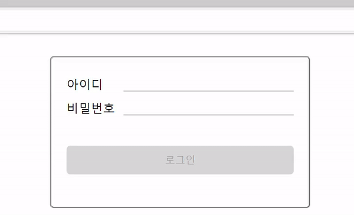
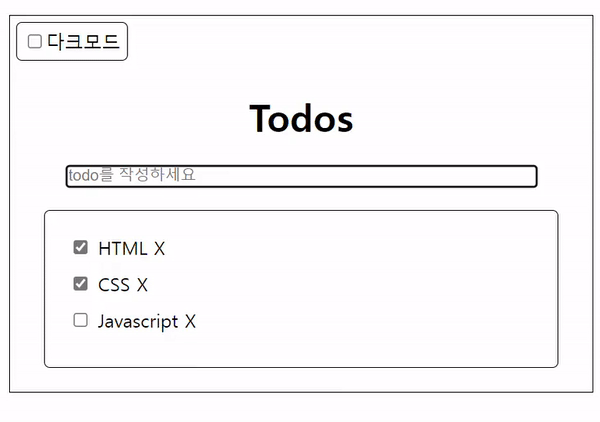

# 제로베이스 Front-end 최종과제
`공부기간: 21. 11. 01 ~ 진행 중`

## 1. 로그인 화면 구현 


### 1. HTML  
- form 태그를 사용하는 로그인 창 만들기
- ID / PW 태그를 div로 감싸 block 형태로 만들기
- PW ~ Btn 사이 warning message 삽입하기
- button 태그 기본 속성 disabled
    ```html
        <form> <!-- 축약 version --->
            <fieldset>
                <div class="input-box id-box">
                    <label for="userId"> Text </label>
                    <input type="text" id="userId">
                </div>
                <div class="input-box pw-box">
                    <label for="userPw"> Text </label>
                    <input type="password" id="userPw">
                </div>
                <!-- label 태그의 for 속성으로 가능 요소(input)를 참조한다 -->
            </fieldset>
        </form>
    ```
---

<br>  

    ### 2. CSS  
- ID / PW label 너비 맞추기
    ``` css
        label {
            display: block; /* label 태그의 display 속성 변경 후 */
            width: 25%; /* 너비 변경*/
        }
    ```
- input tag의 너비 상위 요소 너비의 나머지 부분 전체 사용하기
    ``` css
        input {
            flex: 1 /* 수평 배치 된 flex 박스에서 상위 요소의 나머지 너비 전체 사용 */
        }
    ```
---

<br>  

#### 3. Javascript
- addEventListener('onclick') to login button for alerting message
    ``` javascript 
        const btnLogin = document.querySelector(".btn-login");

        btnLogin.onclick = () => {
            // if ~ else if ~ else 조건문
            // input for userId의 value 값은 template lietral을 활용하여 값 추출
        }
    ```
- setAttribute, removeAttribute for expressing on the viewport along with the length of password.
    ```javascript
        const pw = document.getElementById("userPw")

        pw.onkeydown = () => {
            // if ~ else if ~ else 조건문
            // setAttribute("attribute", "value")
            // removeAttribute("attribute", "value")
        }
    ```
---
<br>

## 2. 투두리스트 기능 구현 


### 1. HTML
- 주요 구조 코드
    ```html
        <div class="container">
            <div class="dark-check">
                <input type="checkbox" class="dark-mode">
                <span class="mode-text"> 다크모드 </span>
            </div>
            <h1 class="title">Todos</h1>
            <input class="input-todo" placeholder="todo를 작성하세요" autofocus>
            <ul class="todos">
                <!-- <li>
                    <label>
                        <input type="checkbox">
                        HTML
                    </label>
                    <span>X</span>
                </li> -->
                <!-- 해당 li태그는 자바스크립트로 구현 -->
            </ul>
        </div>
    ```
---
<br>  

### 2. CSS
기본 css를 활용하였음. (향후 코드 파일 참조)

---
<br>

### 3. Javascript
1. main.js 파일
    - 렌더링 시 ul 태그 내부 "로딩 중..." 글자 표현.
    - html 대신 자바스크립트를 통한 ul>li 요소 렌더링.
    ``` javascript 
        const todoInput = document.querySelector(".input-todo");
        const todoList = document.querySelector(".todos");

        // li 내부 정보를 todos 배열로 저장
        const todos = [
            {
                id: 1,
                content: "HTML",
                completed: true
            },
            {
                id: 2,
                content: "CSS",
                completed: true
            },
            {
                id: 3,
                content: "Javascript",
                completed: false
            },
        ]

        // 렌더링 시 화면 구현
        function loadMsg() {
            todoList.innerHTML = "로딩 중...";
            etTimeout(() => { loadTodoList(todos)}, 1000); // 1초 뒤 loadTodoList 함수 실행
        }

        // ul>li 요소 구현
        function loadTodoList(todos) {
            todoList.innerHTML = todos.map(todo => createHTMLElemnet(todo)).join(''); // join API를 통해 문자열 조합 (공백)
        }

        // todos 배열의 각 객체의 key와 value를 활용하여 li 요소 구현
        // todos의 completed 값에 따라 체크여부 표현 
        function createHTMLElemnet(todo) {
            return `<li>
                <label>
                    <input type="checkbox" ${todo.completed ? "checked" : ""}> ${todo.content}
                </label>
                <span> X </span>
             </li>`
        }

        loadMsg();

    ```
<br> 

2. mode.js 파일
    - 각 모드 함수
    ``` javascript
        const container = document.querySelector(".container");
        const modeText = document.querySelector(".mode-text");
        const checkBox = document.querySelector(".dark-check");
        const todoBox = document.querySelector(".todos");

        function dark() {
            container.classList.add("dark"); // dark 클래스 추가하여 style 변경
            checkBox.style.border = "1px solid #fff";
            checkBox.setAttribute("data-key", "dark");
            todoBox.style.border = "1px solid #fff";
            modeText.innerHTML = "다크모드"; // span태그 내부 text 변경
        }

        function light() {
            container.classList.remove("dark"); // dark 클래스 제거하여 style 변경
            checkBox.style.border = "1px solid #333";
            checkBox.setAttribute("data-key", "light");
            todoBox.style.border = "1px solid #333";
            modeText.innerHTML = "라이트모드"; // span태그 내부 text 변경
        }
    ```
    - 다크모드 ↔ 라이트모드 (addEventListener > 'click' > class 추가 / 제거)
    ``` javascript
        const isDark = document.querySelector(".dark-mode");

        isDark.onclick = () => {
            isDark.checked ? dark() : light();
            localStorage.setItem("currentmode", isDark.checked); // localStorage에 currentmode (key) : "ture" or "false" (value) 저장
        }
    ```
    <br> 
    
    - 사용자가 지정한 모드 localStorage에 저장하기  
    윈도우 로딩할 경우 localStorage에 저장된 모드로 화면 렌더링
    ``` javascript
        window.addEventListener('load', () => {
            if (localStorage.getItem("currentmode")==="true") {
                dark();
                isDark.checked = true;
        };
        // 라이트 모드의 경우 html 기본 값으로 설정되어 javascript로 동작할 필요 없음.
});
    ```


---
<br>  


### 보완할 점
---
1. 로그인 화면 구현 시 비밀번호의 글자수를 구하는 경우  
    `input(text와 password, 혹은 email 등).value.length`를 사용했는데,  
    [정규표현식](https://developer.mozilla.org/ko/docs/Web/JavaScript/Guide/Regular_Expressions)을 사용하여 수정해볼 것
2. 투두리스트에서 항목 추가하는 함수 구현해볼 것.  
    `input([type="text"]).addEventListner('submit', () => { ... })`

<br>

### 소스 템플릿 출처
__제로베이스 https://zero-base.co.kr/__